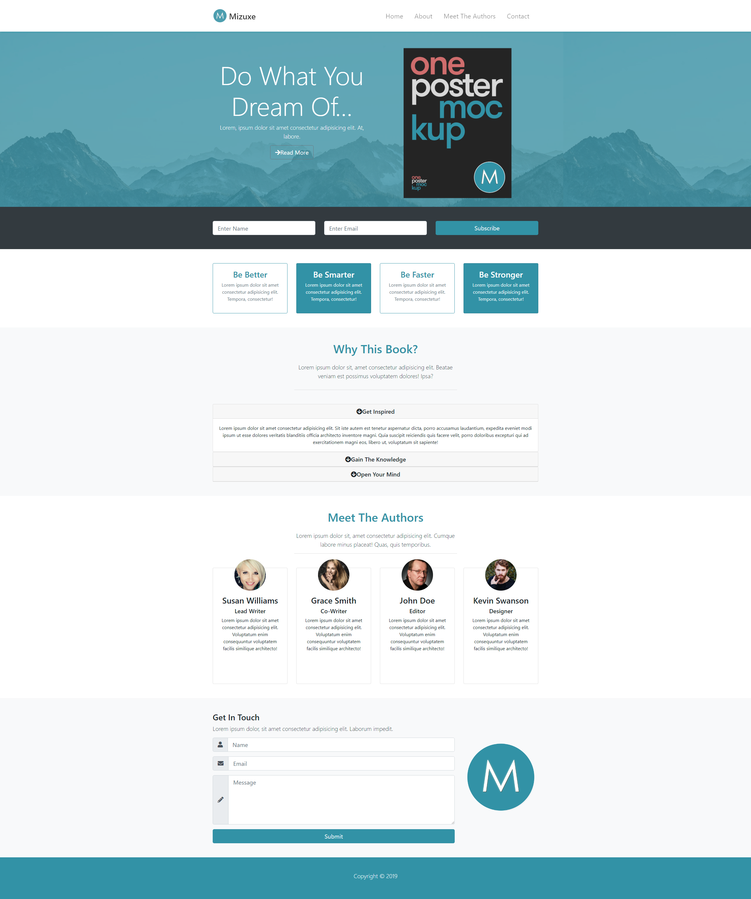

# Udemy Mizuxe Project
This project is for learning purpose using Bootstrap 4.
Mizuxe is a responsive one page website template for self-help books. 

## Components
- Navbar at the top with logo
- Showcase area with an overlay
- Newsletter section with form in line
- Boxes
- Accordion section (open/close)
- Meet the authors section with images over cards
- Contact form (input groups with icons and logo)
- Footer with copyright

There are also implemented:
- scroll spy for navigation and scroll up each section.
- **Koala** - SASS compiler
- **SASS** - CSS pre-processor for _variables_, _nest styles_.

## Screenshot of the page

## External Resources Used
This site was built using:
- [Bootstrap](https://getbootstrap.com/)
- [Font Awesome](https://fontawesome.com/)
- [Koala](http://koala-app.com/)
- [Source files for SASS](https://getbootstrap.com/docs/4.3/getting-started/download/)